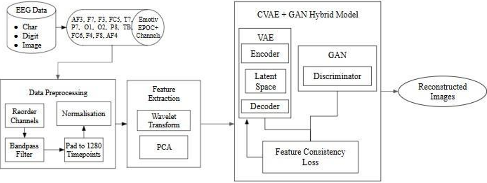
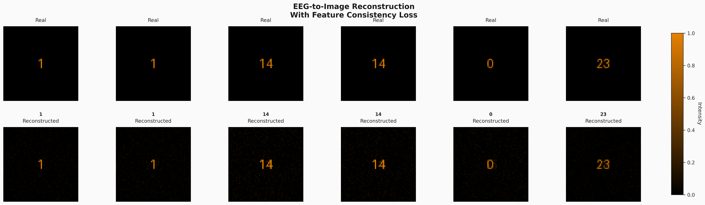
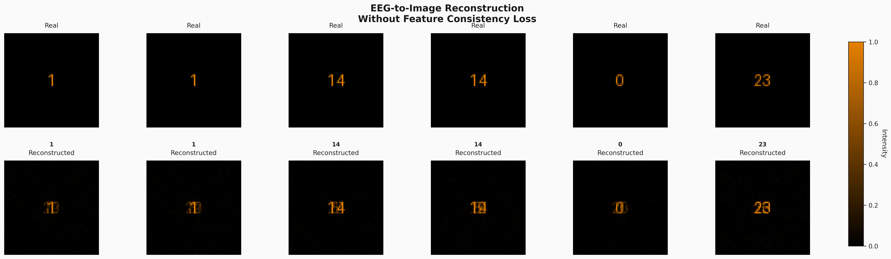

# NeuroSketch
This system converts EEG brain signals into visual sketches using a hybrid CVAE-GAN model. Feature Consistency Loss ensures the generated image accurately reflects the person’s underlying brain activity.

# Overview
This project focuses on generating images from EEG brain signals using a deep learning framework. In this system, we use publicly available EEG datasets recorded from healthy participants while they viewed characters, digits, and images. The collected signals are preprocessed by reordering channels, applying a band-pass filter to remove noise, padding timepoints, and normalizing the data. Wavelet Transform and PCA are used to extract meaningful patterns from the EEG features. These refined features are then passed into a hybrid CVAE–GAN model, where the CVAE learns the mapping between EEG features and real images, and the GAN enhances the quality and realism of the reconstructed outputs. A Feature Consistency Loss ensures that the generated images match the subject’s brain activity more accurately. Although the current dataset comes from healthy individuals, the system is designed to support future applications such as helping non-communicative or unconscious patients express their subconscious visual thoughts.

# Architecture

# CVAE-GAN Analysis

# CVAE-GAN Training Summary with FCL

# CVAE-GAN Training Summary without FCL

| **Dimension**         | **Without FCL**                  | **With FCL**                     | **Outcome** |
| --------------------- | -------------------------------- | -------------------------------- | ----------- |
| Training Smoothness   | Slightly noisy learning curve    | Stable convergence               |   Improved  |
| Loss Magnitude        | Higher and fluctuating           | Lower and controlled             |   Improved  |
| Adversarial Stability | Oscillations during GAN training | Balanced generator–discriminator |   Improved  |
| Generalization        | Wider validation loss spread     | Better validation alignment      |   Improved  |

# Generated Images With and Without FCL

